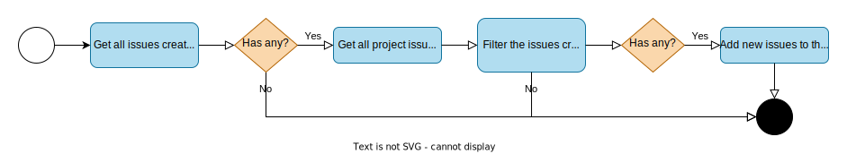

# github-add-issues-to-project-worker

Scheduled Cloudflare Worker that all public issues created by an user to a projects user

---

## Why?

With the increase of repositories within different organizations, it became hard to keep up with all the issues we created. To simplify the management of our work, we decided to start using the GitHub Project, where we can display all our issues from different organizations in different views (table, board, etc).

The GitHub Project already has some automation to add to the projects the issues created within a repository, nevertheless, this is not a great fit since we want from multiple organizations.

We then had the idea to create a cron job that gets all the issues created or assigned to us and adds them to the project.

## Architecture



First we get all the issues created and assigned to the users. For this we use the GitHub GraphQL API, the query type, where the root type is `search`.

Then we get the information of the project namely the list of its issues. Once again we use the GitHub GraphQL API, the query type, but this time the root type is `user`.

We filter the first list of users to get only the issues that do not exist in the project already. In this way we minimize the calls to GitHub.

And finally, we add the new issues to the project. We use the GitHub GraphQL API, the mutation type, where the root type is `addProjectV2ItemById`.

## Instructions

This worker was bootstrapped using [worker brick](https://github.com/dart-pacotes/.brick) and configured with [wrangler](https://github.com/cloudflare/wrangler) CLI. You can install it via NPM: `npm install -g wrangler`

### Hooks

This repository is configured with client-side Git hooks that automatically format + lint the codebase before each push. You can install it by running the following command:

```bash
./hooks/INSTALL
```

### Development

To properly run this service, you will need to a setup a `.dev.vars` file. Start by creating a copy of the `.dev.vars.tpl` file and fill the variables with values appropriate for the execution context.

|          Variable Name          | Variable Description                                                           |
| :-----------------------------: | :----------------------------------------------------------------------------- |
|      `GITHUB_ACCESS_TOKEN`      | GitHub access token.                                                           |
| `GITHUB_PROJECT_OWNER_USERNAME` | Username of the project owner.                                                 |
| `GITHUB_ISSUES_OWNER_USERNAMES` | Usernames (separated by `,`) of who the issues were created by or assigned to. |
|     `GITHUB_PROJECT_NUMBER`     | Project number.                                                                |
|        `QUERY_PAGE_SIZE`        | Amount of items to return in each page query.                                  |

Run the local server via `npm run start`

Trigger an instant cronjob via `curl "http://localhost:8787/__scheduled?cron=*+*+*+*+*"`

### Deploy

Setup worker environment variables with the following one-line:

```bash
IFS='='; ENV_FILE=.dev.vars; cat $ENV_FILE | while read line || [[ -n $line ]]; do read -ra envy <<< $line; wrangler secret put ${envy[0]} <<< ${envy[1]} ; done
```

Deploy to Cloudflare via `npm run deploy`

## Contact

This template was prepared by:

- João Freitas, @freitzzz
- Rute Santos, @rutesantos4

Contact us if you need help on your project!
